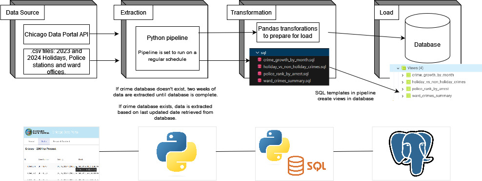
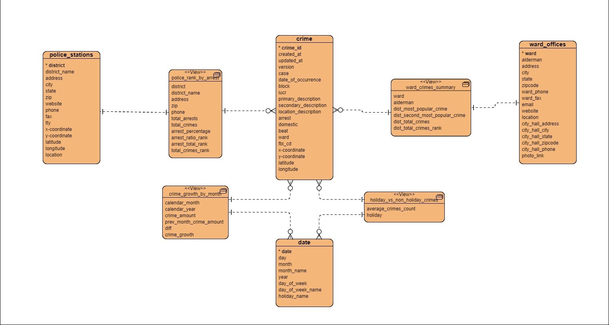

# DEC Project 1 - Chicago Crime

## Project Context and Goals

The goal of this project was to create an end-to-end pipeline that will extract data from a constantly-updating (live) dataset and sucessfully load it to a relational database, imitating a real-life data warehouse. Transformations on the data would be done in between and post-loading (ETL and ELT processes) to also simulate potential data manipulation requirements of real-time applications.

The data should be loaded in an easy-to-use format so as to allow the data analysts/data scientists to immediately begin working with it without having to commit a sizeable amount of manipulation techniques. This means that the data should be loaded onto several distinct tables that can easily be merged with each other and that contains intuitive column names and data types for each distinct record.

The DA/DS person should not be concerned with the accuracy of each data record and the process by which each data record is inserted or updated within the database. The pipeline should abstract and automate all of these processes as much as possible.

## Business Objective

The objective of our project is to provide analytical datasets from our Chicago crime API and supporting police, ward and holiday databases. The datasets are clean, regularly updated, and supported with several custom table views generated from these datasets. 

## Consumers

The users of our data are Chicago city budget and policy analysts and officials. Our data is useful for getting up-to-date information on crimes that occur throughout Chicago. Our users would want to access the data primarily through sql queries and the custom sql views from the databse. However, this data lends itself very nicely to the creation of dashboards with maps and metrics. 

## Questions

There are three general question catagories our data addresses: broad questions about crime in the city of Chicago, questions about crime incidents during holidays, and crime incidents within police districts. 

Examples of these questions include but are not limited to:
- What day of the week seems to have the highest number of crimes?
- What month of the year has the most crimes?
- What time of the day (morning, afternoon, evening, night) seems to have the highest number of crimes?
- Which holidays have the highest incidences of crime and may require additional staffing or resources?
- Which beats have the most violent crimes? 
- Which police districuts may need additional resources, specialized training, etc. based on the type and quantity of crime?

Our data will allow our users to make resourcing and policy decisions based on historial and newly generated data. 

## Source datasets

The chosen live dataset for the project was the [Chicago Crimes One Year Prior to Present](https://data.cityofchicago.org/Public-Safety/Crimes-One-year-prior-to-present/x2n5-8w5q/about_data) which stores all reported crime incidents in the city of Chicago, Illinois. This public dataset provides the following advantages:

   - The Chicago Data Portal provides an API endpoint which allows us to make unlimited HTTP requests to extract the dataset.
   - The dataset contains a significant amount of distinct columns (fields) that can then be joined separately with a different dataset to facilitate data aggregations.
   - The dataset also contains system fields that hold metadata information for each record (such as when the row was created, last updated, and a unique identifier for the row).
   - The dataset can be queried prior to extraction based on a SQL-like query language in order to specify which exact data you need (e.g. data created after a specific date).

In addition to the Chicago Crimes data, we used static datasets for 2023 and 2024 holidays, police stations and ward offices. 

## Solution architecture

Below is the solution architecture description and diagram, illustrating the key components and their interactions in our project.

**Extraction Pattern:**

We are using a live dataset that updates periodically (weekly). For the first time the code is run, the pipeline extracts the data two weeks at a time until all data completed the ETL process. This serves as a backfill of the databse. If the database exists, the pipeline identifies the max data updated field in the database and extracts from that date to today's date. The extraction pipeline is scheduled to run daily to check if data has been updated. 

**Data Loading Patterns:**

For the first data load, the pipeline extracts, transforms and loads the two weeks of data until the database has been completely backfilled. If the database exists, new data is upserted into the database based on the unique ID number for each record.   
    
**Data Transformation Patterns:** 

There are two places we use data transformation patterns. The first is after the extract of the crime data and import of the .csv data. We used Pandas to drop columns, change column names and generate the holiday dataframe. The second is after the data has been loaded into the database. We use sql templates to generate views in the database. These transformation include joining, grouping, sorting, and aggregation function. The SQL transformations result in several table views in the database. Our ERD diagram can be seen below:

**Project Flow Chart** 

For more details on project data flow, please see the following 

## Project Outline
1. Extraction 
   Code to extract incrementally 
2. Transformations
   Pandas Transformation 
    - Drop columns
    - Change column names
    - simple merge 
3. Scheduling 
4. Loading data to postgres
5. Write Unit tests
6. Transforming using SQL
   SQL Transformation 
    - Aggregations (weekends vs weekdays)
    - grouping 
    - having/where
    - window functions
7. Docker
8. AWS 
9. Presentation and additional Documentation

## Final Dataset and Demo Run (if possible)

The culmination of our efforts resulted in a refined dataset ready for analysis. We conducted a demo run to showcase the capabilities of our solution. Here are some highlights:
    
   Dataset Overview: Brief description of the final dataset.\
   Demo Run: Steps and outcomes of the demonstration.

# Limitations and Lessons Learned

Throughout the course of the project, we encountered various challenges and gained valuable insights. Here are some key lessons learnt during the project:

   - It was very important to us as a group to be able to practice each step of the process. This was extremely valuable in contributing to our learning but did slow us down and may have added additional work or stress toward the end. 
   - We had hoped to eliminate some of the technical debt in the code by making it more modular or object oriented. This is something that can be a follow on task.
   - We started by using Trello to manage tasks but found it worked better for our group to orangize tasks in the issues section of github. We were able to add code, comments and have discussion for each issue. 

# Installation and Running Instructions 

